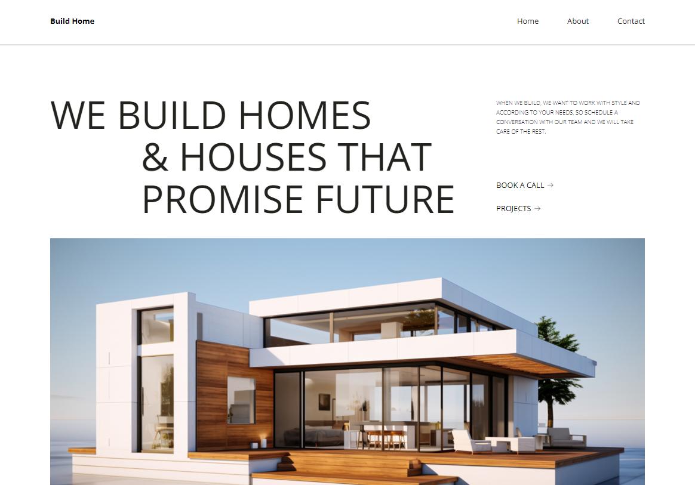

# 🏠 Build Home - Construction Company

This repository contains the project files for Build Home, a professional construction company website built using Webflow. The site showcases services such as home building, renovations, and project management. It features a clean, responsive design, ensuring a seamless experience across all devices.

## 🎯 Key Features
- **Professional Design**: Clean and trustworthy interface.
- **Responsive Layout**: Fully optimized for mobile, tablet, and desktop.
- **Comprehensive Services**: From home construction to renovations.

## 🔗 Live Demo
Check out the live website [here](https://build-home-fe3665.webflow.io/).

## 🖼️ Screenshot

## 🛠️ Technologies Used
- **Webflow**: For design and development.

## 📧 Contact
For any inquiries or collaboration opportunities, feel free to reach out via email: ilicwebservices@gmail.com
